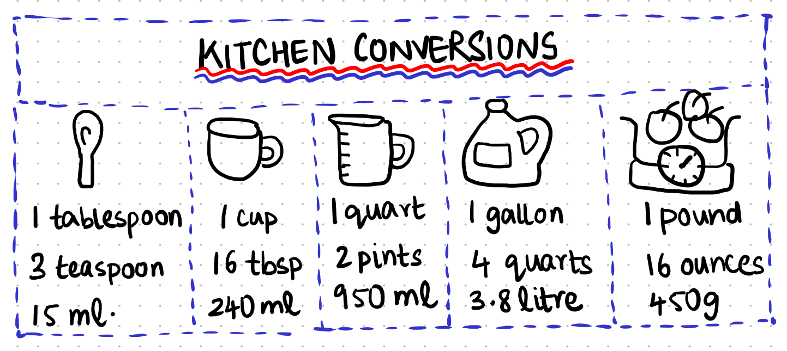

::::::::::::::::::::::::::::::::::::::: objectives

- Make our repository follow a 'standard' Python project format
- Add a test and testing framework
- Run the tests and a linter on GitHub - using a branch and a Pull Request

::::::::::::::::::::::::::::::::::::::::::::::::::

:::::::::::::::::::::::::::::::::::::::: questions

- How should I structure a Python project?
- How can I test my code to prevent bugs?

::::::::::::::::::::::::::::::::::::::::::::::::::

## 1\. Structuring a Project

Alfredo would like to exchange recipes with his friends in Europe. They measure everything in grams and do not understand imperial measures.
So he decided to start a Python project to automate the conversion for the ingredients' quantities.

{alt='kitchen conversions'}
Kitchen conversions doodle by Sneha.

Most Python projects are structured in a similar way. There are very good reasons for this - if you follow the 'standard', other people who approach your code will recognise parts of it and will know by default how to install your code, run any tests that might exist, and where to look for source code or to change things like the dependencies that are required.
 
The following is a simple Python project with a typical structure (the `.git` and some cache directories are omitted):

```output
unitconverter/
├── .codespell
│   ├── ignore_lines.txt
│   └── ignore_words.txt
├── .editorconfig
├── .github
│   └── workflows
│       ├── linters.yaml
│       └── pytest.yaml
├── .gitignore
├── .pre-commit-config.yaml
├── .pylintrc
├── .reuse
│   └── templates
│       └── compact.jinja2
├── DEVELOPMENT.md
├── LICENSE.txt
├── LICENSES
│   └── Apache-2.0.txt
├── README.md
├── REUSE.toml
├── pyproject.toml
├── requirements.txt
├── setup.py
├── src
│   └── unitconverter
│       ├── __init__.py
│       ├── functions.py
│       └── test_functions.py
└── uv.lock

# tree -a -I .git -I .ruff_cache -I .pytest_cache -I recipe_unitconverter.egg-info -I dist -I .mypy_cache -I __pycache__ unitconverter/
```

You can see [this sample project](https://github.com/mambelli/unitconverter) and clone it with (assuming you use CLI and HTTPS):

```bash
$ git clone https://github.com/mambelli/unitconverter.git
```

If using SSH, you can clone it with:

```bash
$ git clone git@github.com:mambelli/unitconverter.git

```

We'll talk of these folders/files one at a time:

### src/

The source tree where all the Python files reside.

### unitconverter/

Inside the project source tree we normally have a folder which matches the name of the Python package. This is done so that from the src directory, the code within the package can be imported with:

```python
import unitconverter
```

You can see this for e.g. in the source repository of the [NumPy library](https://github.com/numpy/numpy).

Within this folder, we can store code files (e.g. functions.py) and further subdirectories (sub-packages). These will then be importable too.

#### functions.py

This is a module, just a standard Python file with classes and functions in it. You can have as many of these as you like, but generally people organise them around what the code is doing. So for e.g if you have a few methods that deal with I/O, you might create a file called `io.py` and put all of those methods there. Organising your code across multiple files like this is a very good idea - it makes it easier to find things.

#### `__init__.py`

The `__init__.py` file is effectively as set of instructions that get run when you import a Python package. So with a blank `__init__.py`, nothing happens if you run `import unitconverter` in a Python session. If you want to use methods from the functions.py file. What is common is to import certain methods into the top level of the module, for e.g.:

```python
from .functions import convert_imperial
```

Then, in a Python session, you would be able to do the following:

```python
>>> import unitconverter
>>> unitconverter.convert_imperial("3 oz")
85.0485 gr
```

### pyproject.toml

A ['pyproject.toml'](<https://packaging.python.org/en/latest/specifications/pyproject-toml/) file acts as a configuration file for packaging-related and other tools as specified in
[PEP 518](https://peps.python.org/pep-0518/) and [PEP 621](https://peps.python.org/pep-0621/).

A 'pyproject.toml' file is subdivided in sections separated by square brackets labels, called tables.

The `[build-system]` table declares any Python level dependencies that must be installed in order to run the project’s build system successfully and must have at least the `requires` attribute.

The `[project]` table specifies the project’s core metadata, like the name, version, and authors. Note how the project name, used in the `pip` installation, may be different from the package name, used in the Python import statement.
If [project] is missing, the build backend will provide all the information, at least name and version. This may come from other files like 'setup.py'.

The `[tool]` table (and `[tool.NAME]` sub-tables) is where any other tool related to your Python project can have users specify configuration data, e.g. the black formatting tool would store its configuration in [tool.black].

### Legacy specifications of packages and requirements

It may be convenient to add legacy project specifications. 
They contain redundant information, already in 'pyproject.toml'.
But other peoples using your project may not be familiar with 'pyproject.toml' or older versions of Python may not support all its features. 

#### setup.py

A setup.py file is just a list of instructions for Python that tell it how to install your package, and what it's made up of. There are a myriad of options, but a very simple one for this project could be:

```python
from setuptools import setup

setup(
    name="recipe-unitconverter",
    version="0.0.1",
    packages=["src/unitconverter"],
    install_requires=[
        "numpy",
    ],
)
```

Notice that there is a section called `install_requires`. It is a list of external packages used in the project. On install with pip, Python will make sure that 'numpy' is installed if not already available. If it can't, the installation will fail.

#### requirements.txt

This is just a text file where you can put any dependencies your package needs to work. If necessary, you can constrain some of your package dependencies to specific versions, for e.g.:

```output
pytest
numpy>=2.0.2
```

To install all of the dependencies, you can run `pip install -r requirements.txt`. This is well known by most people working with Python. Generally you should try to install things via pip like this, and not via Anaconda (unless you have no choice). This is because Anaconda is less portable:
- Introduces non-Python libraries that mayinterfere with other tools like SSH
- Is not usable by commercial organisations without a paid for license. This matters if you have external companies as collaborators ([conda-forge](https://github.com/conda-forge) and [miniforge](https://github.com/conda-forge/miniforge) are an open-source version of Anaconda)
- Was introduced mainly for distributing compiled dependencies. This is now well handled by pip with the introduction of `wheels`
- Anaconda is not usable or is heavily discouraged on many HPC clusters.

### uv.lock (and pylock.toml)

A lock file allows to reproduce the installation of a Python project, with the exact same sets of dependencies, from system to system.

For this project I'm using `uv.lock`, the one provided by the [uv](https://github.com/astral-sh/uv) tool. 
There is a Python standard ([pylock.toml](https://packaging.python.org/en/latest/specifications/pylock-toml/) for a lock file, but it is fairly recent and not as complete.
You can install uv and generate the lock file with:

```bash
$ pip install uv
$ uv lock
```

uv is a very nice tool to manage all your project needs: from initializing the project, to managing the environment, to building and releasing it. 
This is beyond the scope of this introduction, but you can find more on the [uv project guide](https://docs.astral.sh/uv/guides/projects/).


### README.md

This file offers general information about the project. It is the one displayed by GitHub at the end of the main code page.
It is possible to add badges with the status of the CI tests.

### Other files

- `DEVELOPMENT.md`: development instructions for collaborators and your future self.
- `LICENSE.txt` (and `REUSE.toml`, `.reuse` and `LICENSES`): it's the common place for your project's license, seen also in the [licensing episode](11-licensing.md), very important when making your code public.
  See the [Licensing compliance section](# Licensing compliance) below for a complete licensing solution : reuse can establish and verify licensing complaiance.
- `src/unitconverter/test_functions.py`: unit tests for `functions.py`, see the [testing section](# GitHub CI: unit tests and linting) below.

Hidden files, visible with `ls -a`:
- `.editorconfig`: joint comfiguration recognized by many different editors
- `.git` and `.gitignore`: Git internal files, seen in the [Creating a repository](03-create.md) and [Ignoring Things](06-ignore.md) episodes respectively
- `.github` directory: contains GitHub automation files, see the [Testing and GitHub CI section](# GitHub CI: unit tests and linting) below.
- `.pre-commit-config.yaml`: pre-commit configuration file, see the [next section](# Adding Pre-commit checks).
- `.pylintrc`: configuration file of pylint, a Python linter


## 2\. Adding Pre-commit checks

It is possible to run some checks before each commit command, taking advantage of the hooks mechanism in Git.
A pre-commit will guarantee that committed code always follows the desired standard. 
To start using pre-commit you have to add a pre-commit config file and to install pre-commit.

Add a pre-commit config file named `.pre-commit-config.yaml` with the following content for an initial set of checks (some lines redacted for clarity, the full version is on the repo).
This configuration runs some basic file checks and more elaborate linters ([Black](https://github.com/psf/black), [Ruff](https://docs.astral.sh/ruff/), [mypy](https://mypy-lang.org/), [REUSE](https://reuse.software/)):

```yaml
# For more information see
#  https://pre-commit.com/index.html#install
#  https://pre-commit.com/index.html#automatically-enabling-pre-commit-on-repositories
default_language_version:
  # force all unspecified python hooks to run python3
  python: python3
repos:
  - repo: "https://github.com/pre-commit/pre-commit-hooks"
    rev: v5.0.0
    hooks:
      - id: check-ast
      - id: check-docstring-first
      - id: check-toml
      - id: check-merge-conflict
      - id: check-yaml
      - id: end-of-file-fixer
      - id: fix-byte-order-marker
      - id: mixed-line-ending
      - id: trailing-whitespace
        args:
          - "--markdown-linebreak-ext=md"
  - repo: "https://github.com/pre-commit/pygrep-hooks"
    rev: v1.10.0
    hooks:
      - id: python-check-blanket-noqa
      - id: python-check-blanket-type-ignore
      - id: python-use-type-annotations
  - repo: "https://github.com/pycqa/isort"
    rev: 6.0.1
    hooks:
      - id: isort
  - repo: "https://github.com/psf/black"
    rev: 25.1.0
    hooks:
      - id: black
  - repo: "https://github.com/pre-commit/mirrors-prettier"
    rev: v3.1.0
    hooks:
      - id: prettier
        # HTML pre section bug https://github.com/prettier/prettier/issues/17042
        exclude: "doc/factory/troubleshooting.html"
        exclude_types:
          - "python"
        additional_dependencies:
          - "prettier"
          - "prettier-plugin-toml@0.3.1"
  - repo: https://github.com/astral-sh/ruff-pre-commit
    # Ruff version.
    rev: v0.11.11
    hooks:
      # Run the linter.
      - id: ruff
        #  No auto-fix
        # args: [ --fix ]
      # Don't Run the formatter.
      # - id: ruff-format
  - repo: "https://github.com/asottile/pyupgrade"
    rev: v3.20.0
    # rev: e695ecd365119ab4e5463f6e49bea5f4b7ca786b
    # lock to v2.31.0 (must specify the git hash), v2.32.0 requires python >= 3.7
    hooks:
      - id: pyupgrade
        exclude: "^skip/this/file.py$"
        # needs to be py3.6 compatible
        args:
          - "--py36-plus"
  - repo: https://github.com/pre-commit/mirrors-mypy
    rev: v1.16.0
    hooks:
      - id: mypy
  - repo: https://github.com/codespell-project/codespell
    rev: v2.2.4
    hooks:
      - id: codespell
        args: [
            # Pass skip configuration as command line arguments rather than in the
            # config file because neither cfg nor TOML support splitting this argument
            # across multiple lines.
            # Globs must match the Python `glob` module's format:
            # https://docs.python.org/3/library/glob.html#module-glob
            "-S",
            ".codespell/ignore_words.txt",
            # Write changes in place
            "-w",
          ]
        additional_dependencies:
          - tomli
  - repo: https://github.com/fsfe/reuse-tool
    rev: v5.0.2
    hooks:
      - id: reuse
        additional_dependencies:
          - python-debian==0.1.40
```

To install it run from the repository root:

```bash
pre-commit install
```


You may want to setup automatic notifications for pre-commit enabled repos. 
This will suggest updates to your `.pre-commit-config.yaml`:
https://pre-commit.com/index.html#automatically-enabling-pre-commit-on-repositories

You can also run pre-commit manually to check all the files:

```bash
pre-commit run --all-files
```


## 3\. Licensing compliance

The Recipe Units Converter is released under the Apache 2.0 license and license compliance is
handled with the [REUSE](https://reuse.software/) tool.
REUSE is installed as development dependency or you can install it manually
(`pip install reuse`). All files should have a license notice:

- to check compliance you can use `reuse lint`. This is the command run also by the pre-commit and CI checks
- you can add on top of new files [SPDX license notices](https://spdx.org/licenses/) like
  ```
  # SPDX-FileCopyrightText: 2025 Alfredo Linguini
  # SPDX-License-Identifier: Apache-2.0
  ```
- or let REUSE do that for you (`FILEPATH` is your new file):
  ```bash
  reuse addheader --year 2025 --copyright="Alfredo Linguini" \
    --license="Apache-2.0" --template=compact FILEPATH
  ```
- Files that are not supported and have no comments to add the SPDX notice
  can be added to the `REUSE.toml` file. REUSE does not support pyproject.toml yet.
- New licenses can be added to the project using `reuse download LCENSEID`. If you are contributing to a project, please
  contact project management if this is needed.


## 4\. GitHub CI: unit tests and linting

First, we'll introduce a new file. In the `src/unitconverter` subdirectory, in a file called `test_functions.py` we can write any tests of methods in `functions.py`. 
The library `pytest` is commonly used for unit tests like this. Pytest looks for files named `*_test.py` or `test_*.py` and can pick up tests written in the following way:

```python
from .functions import convert_imperial

def test_convert_imperial():
    assert convert_imperial("34 liters") == "34.0 liters"
    assert convert_imperial("1 lb") == "453.592 grams"
    assert convert_imperial("2 ounces") == "56.699 grams"
```

Note that both the file name and the method inside have the same name of the module and function they want to test, but are preceded with `test_` - this is compulsory!

With this, when pytest is installed, you can run 'py.test -v' at the command line, and all of your tests will run. 
With [unit tests](https://en.wikipedia.org/wiki/Unit_testing) like this, you can check each component of your code for correctness every time you make changes.

Next, create a file called `.github/workflows/pytest.yaml` with the following content:

```yaml
---
name: PyTest
on:
  push:
    branches:
      - "**" # matches every branch
  pull_request:
    branches:
      - main

jobs:
  run_linters:
    name: Run unit test against code tree
    runs-on: ubuntu-latest
    steps:
      - name: checkout code tree
        uses: actions/checkout@v4
      - name: Set up Python 3.9
        uses: actions/setup-python@v5
        with:
          python-version: "3.9"
          architecture: "x64"
      - name: Install dependencies
        run: |
          python3 -m pip install --upgrade pip
          if [ -f requirements.txt ]; then python3 -m pip install -r requirements.txt; fi
      - name: Unit test
        env:
          PYTHONPATH: ${{ github.workspace }}/src
        run: |
          python3 -m pytest --import-mode=append src
```

This is a basic recipe that will allow your tests to run on GitHub. Add both of these files to your staging area and commit them, and then push to GitHub.

The `unitconverter` example includes a second CI configuration file, to run common Python linters.

:::::::::::::::::::::::::::::::::::::::: keypoints

- While there is often variation, most Python projects follow a similar structure for their code
- Doing so is beneficial because it allows components of your code to be reused more easily by yourself and others
- Testing can be 'automatic' rather than manual. This catches many issues before they become a problem - this is continuous integration (CI)
- The concepts here can be used for all programming languages - not just Python - and are pretty much universally used by professional software developers

::::::::::::::::::::::::::::::::::::::::::::::::::


